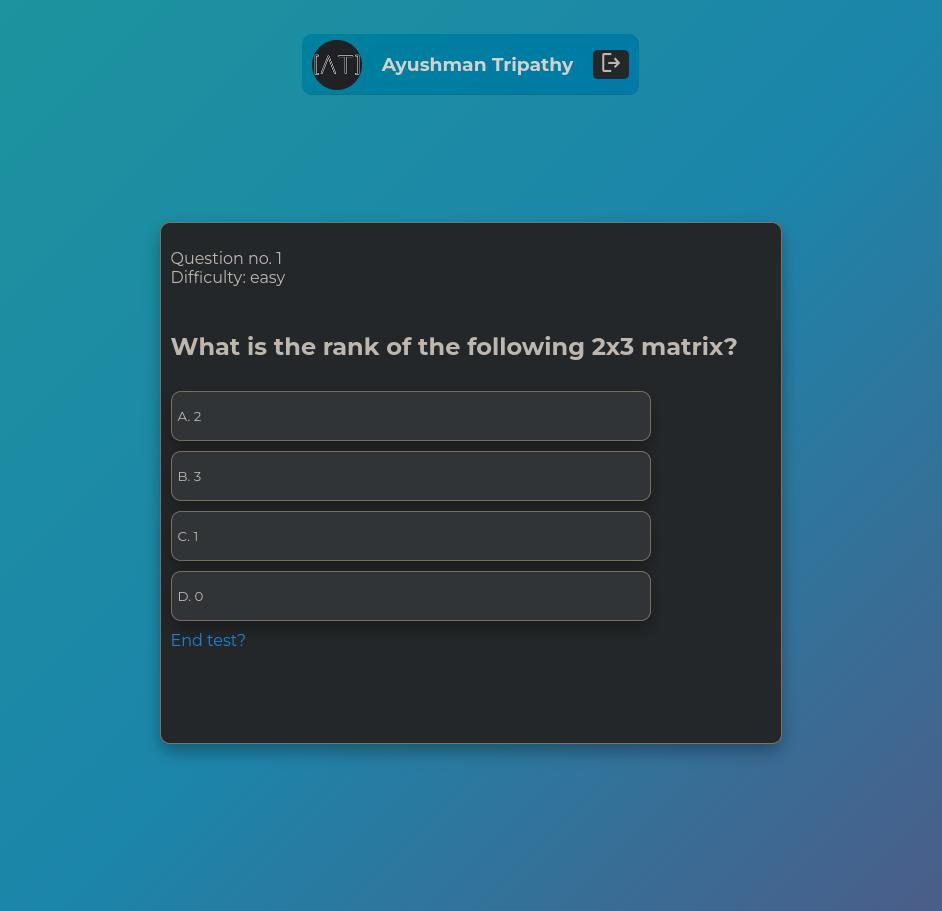
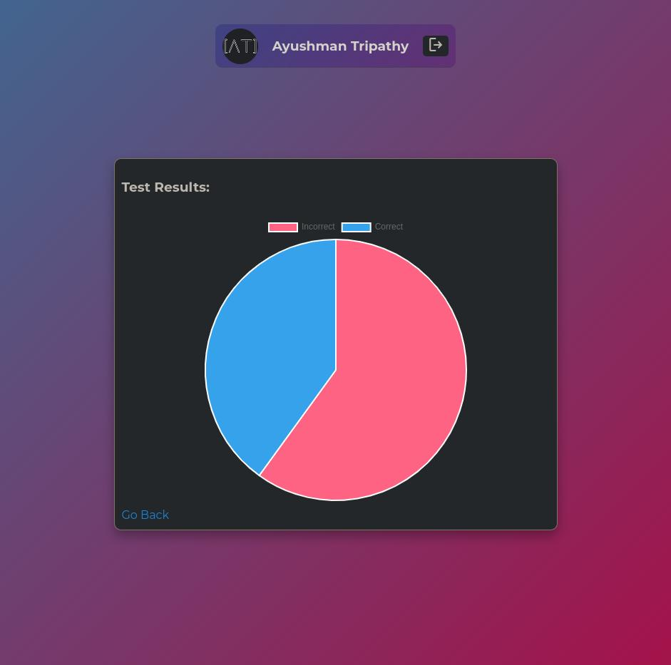

# Quiz App

I made this in a (4hr + 4hr) session to learn flask and authentication in
python. 

#### Screenshots




#### Running locally?

for using locally follow these steps after cloning the repo

-   create virtual enviroment

```
python -m venv venv
```

-   for windows

```
.\venv\Scripts\activate.bat
```

-   for Unix/Linux

```
source venv/activate
```

-   install required packages and run

```
pip install -r requirements.txt
flask run
```

-   visit http://127.0.0.1:5000

Tech Stack is

1. Flask
1. AuthLib for OAuth
1. SQLite
1. Sass for styling
1. Chart.js

Features are

1. OAuth login by Google account
1. Difficulty of questions based on your answers
1. Responsive Design
